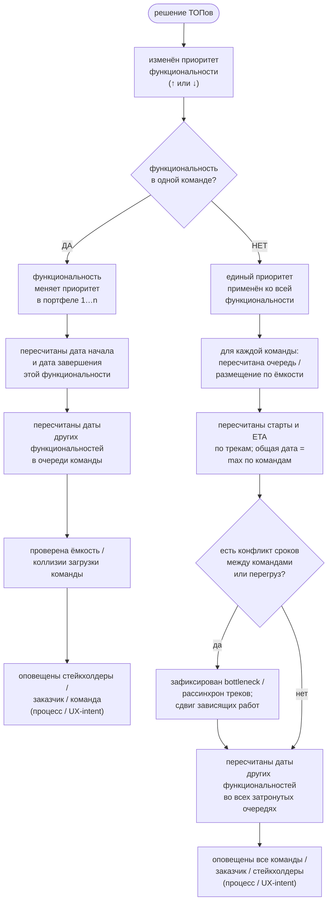

# Use-case: изменение приоритета функциональности

Схема use-case для VI Planer: решение ТОПов → смена сквозного приоритета (`manualRank`) → пересчёт расписания → оповещение.  
Сущность плана — **функциональность** (WorkItem); у неё ≥1 назначения на команды (`assignments`). «Проект» в бытовом смысле = контейнер (`backlog` / тип), а очередь и Gantt живут от приоритета функциональностей.

Соответствует UC-05 в [VI-Planer-requirements.md](./VI-Planer-requirements.md) и логике `schedulePortfolio` / `moveItemToPriority` в `src/model.ts`.

## Схема (flowchart)

> Оповещение — шаг процесса / UX-intent: в приложении уже есть журнал изменений; автоматическая рассылка пока не обязательна.  
> Статичная копия схемы: [priority-change-usecase.svg](./priority-change-usecase.svg).

## Ветки кратко

### Общий триггер
- Источник: решение ТОПов / Portfolio Owner (ранг в карточке или drag ⋮⋮ при сортировке по приоритету).
- Действие: повысить **или** понизить приоритет; система переиндексирует уникальные ранги 1…n (`moveItemToPriority` / `reorderVisiblePriority`).
- Далее расписание зависит от режима: `manual` (даты как заданы), `teamQueue` (FS-очередь по команде), `maxUtilization` (общий старт команд одной функциональности, ETA = max).

### Ветка ДА — одна команда
- Приоритет меняется только у одной функциональности в общей портфельной нумерации.
- Пересчитываются её старт и завершение в очереди/ёмкости этой команды.
- Сдвигаются следующие работы той же команды (ниже по приоритету или после в FS).
- При перегрузе недели подсвечиваются (capacity / overload).
- Оповещение: команда + заказчик + стейкхолдеры.

### Ветка НЕТ — несколько команд (кросс-командная функциональность)
- Один сквозной `manualRank` на всю функциональность — приоритет не «разъезжается» по командам.
- Каждая назначенная команда пересчитывает свою очередь (`teamQueue`) или совместное размещение (`maxUtilization`).
- Треки команд могут стартовать/заканчиваться в разные недели; дата завершения функциональности = max по трекам (bottleneck).
- При конфликте сроков / перегрузе — явная фиксация bottleneck и сдвиг зависящих работ в очередях всех затронутых команд.
- Оповещение: **все** вовлечённые команды + заказчик + стейкхолдеры.

## Связь с продуктом

| Шаг схемы | Реализация сегодня |
|-----------|-------------------|
| Смена приоритета | `manualRank`, drag/ввод, confirm при конфликте |
| Пересчёт дат | `schedulePortfolio` по активному `ScheduleMode` |
| Одна vs много команд | `assignments.length` / `teamIds(item)` |
| Журнал | change log (`kind: "priority"` / `"schedule"`) |
| Оповещение | процессный шаг; авто-notify — вне текущего SPA |

## Легенда форм

- Скруглённый прямоугольник — действие / состояние.
- Ромб / овал — решение.
- Подпись «процесс / UX-intent» — шаг оргпроцесса, не обязательно уже автоматизированный в UI.
