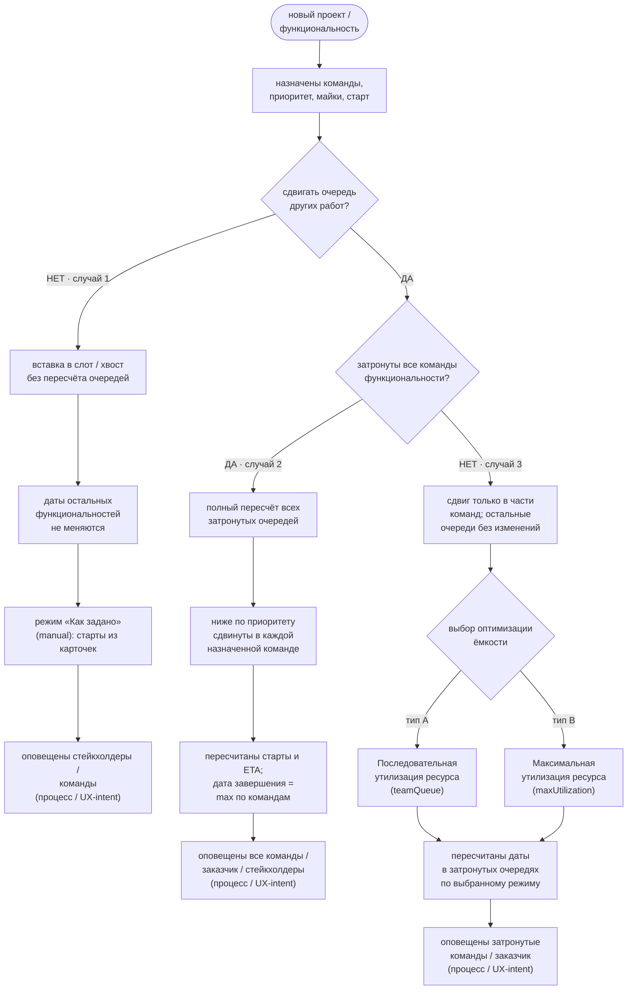

# Use-case: новый проект / функциональность в очередях команд

Схема use-case для VI Planer: появление новой функциональности в портфеле → решение, сдвигать ли очереди → полный или частичный сдвиг → (при частичном) выбор режима оптимизации ёмкости → пересчёт дат → оповещение.

Сущность плана — **функциональность** (WorkItem) с назначениями на команды (`assignments`: майка + `workStartDate`). Очереди живут на вкладке «Очередь команд»; размещение считает `schedulePortfolio` по активному `ScheduleMode`.

Соответствует UC-03 / UC-07 / FR-11 в [VI-Planer-requirements.md](./VI-Planer-requirements.md) и режимам в `src/model.ts` / подписям кнопок в `src/main.ts`.

## Схема (flowchart)

> Оповещение — шаг процесса / UX-intent: в приложении есть журнал изменений; автоматическая рассылка пока не обязательна.  
> Выбор двух типов оптимизации в случае 3 — **процессный intent**; в SPA сегодня режим задаётся глобально кнопками на Gantt / «Очередь команд», а не диалогом на каждую вставку.  
> **Локальная HTML-страница:** [team-queue-usecase.html](./team-queue-usecase.html) (`open docs/team-queue-usecase.html`).  
> Статичная копия схемы: [team-queue-usecase.svg](./team-queue-usecase.svg).

## Три случая кратко

### Случай 1 — вставка без сдвига очереди
- Новая функциональность попадает в портфель (приоритет, команды, майки, плановый старт).
- Остальные работы **не сдвигаются**: даты остаются как в карточках.
- В продукте это режим **«Как задано»** (`manual`): `schedulePortfolio` фиксирует старты по `workStartDate`, перегрузки видны, но FS-/ёмкостный пересчёт чужих слотов не делается.
- Оповещение: команды назначения + заказчик (по процессу).

### Случай 2 — полный сдвиг во всех затронутых командах
- Вставка со сдвигом: работы ниже по `manualRank` в **каждой** назначенной команде пересобираются.
- Полный пересчёт всех затронутых очередей → новые старты / ETA; у кросс-командной функциональности дата завершения = max по трекам (bottleneck).
- В продукте включают ёмкостный режим (`teamQueue` или `maxUtilization`) — оба пересчитывают портфель целиком; «полный» здесь = затронуты все команды этой функциональности.
- Оповещение: **все** вовлечённые команды + заказчик + стейкхолдеры.

### Случай 3 — частичный сдвиг + выбор 2 типов оптимизации
- Новая работа сдвигает очередь **только в части команд** (не все треки функциональности / не все команды портфеля задеты).
- Пользователь **выбирает тип оптимизации ёмкости** (те же две стратегии, что уже в UI):

| Тип | UI-подпись | `ScheduleMode` | Суть |
|-----|------------|----------------|------|
| **A** | **Последовательная утилизация ресурса** | `teamQueue` | FS-очередь по приоритету **внутри команды**; следующая работа ждёт конца предыдущей |
| **B** | **Максимальная утилизация ресурса** | `maxUtilization` | все команды одной функциональности стартуют в одну неделю; дата завершения = **max** по трекам |

- Пересчёт дат только в затронутых очередях по выбранному режиму; незатронутые команды без изменений.
- Оповещение: затронутые команды + заказчик.

## Связь с продуктом

| Шаг схемы | Реализация сегодня |
|-----------|-------------------|
| Новая функциональность | UC-03: карточка → `assignments`, `manualRank`, майки, старт |
| Без сдвига | `ScheduleMode = "manual"` («Как задано») |
| Со сдвигом / оптимизация | кнопки **Последовательная** / **Максимальная** утилизация ресурса → `teamQueue` / `maxUtilization` |
| Пересчёт дат | `schedulePortfolio` по активному режиму (глобально для вкладки) |
| Частичный vs полный сдвиг | process intent: в модели пересчёт всегда портфельный; «затронуты» = команды из `assignments` новой работы и те, у кого сдвинулись слоты ниже по приоритету |
| Журнал | change log (`kind: "create"` / `"schedule"` / …) |
| Оповещение | процессный шаг; авто-notify — вне текущего SPA |
| Выбор A/B на вставке | intent; в UI выбор режима — тогглы на Gantt / Очереди (повторный клик → «Как задано») |

## Легенда форм

- Скруглённый прямоугольник — действие / состояние.
- Ромб / овал — решение.
- Подпись «процесс / UX-intent» — шаг оргпроцесса, не обязательно уже автоматизированный в UI.
